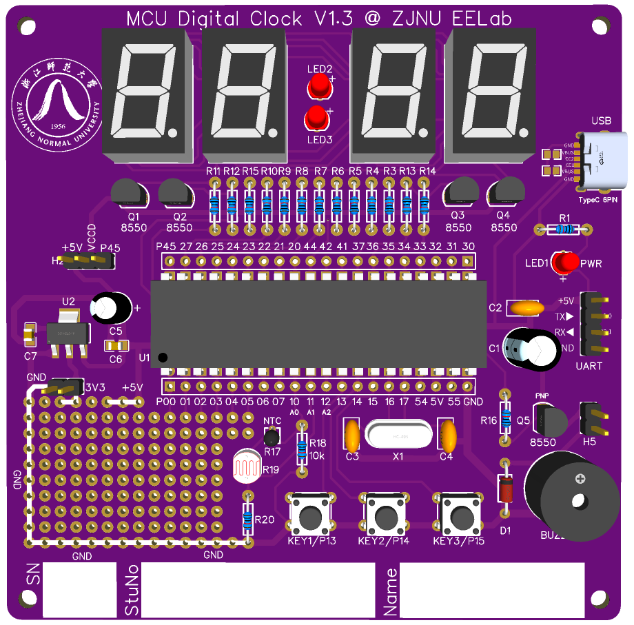

# 多功能数字钟

基于 STC15W4K 系列 8051 单片机与 ZJNU EELab V1.3 数字钟板的课程设计项目，实现时间显示、按键设置、多组音乐闹钟、温度采集、串口通信与设置持久化。

仓库包含 Keil C51 固件、C# WinForms 串口助手、Python 校时工具、硬件参考资料及技术文档。



## 主要功能

- **时间显示与设置**：四位数码管每 3 秒交替显示 HH:MM 与 MM:SS；支持按键设置时、分、秒及长按连发。
- **学号显示**：支持完整学号滚动与末四位固定显示，内容通过配置文件设置。
- **音乐闹钟**：支持三组独立闹钟、三首可选旋律、音乐试听、启用开关及 10 分钟贪睡。
- **温度采集**：使用板载 NTC 分压电路与 ADC 采样；时钟状态下空闲每 10 秒切换时间与温度显示。
- **串口控制**：支持电脑校时、闹钟设置、温度查询、自动息屏开关与立即息屏。
- **设置持久化**：通过内部 EEPROM 保存确认后的时间快照、闹钟配置及自动息屏设置。
- **显示与声音控制**：支持 60 秒无按键自动息屏、按键或闹钟唤醒，以及每秒滴答音开关。

## 硬件与开发环境

| 项目 | 配置 |
| --- | --- |
| 硬件平台 | ZJNU EELab V1.3 数字钟板 |
| 单片机 | STC15W4K 系列；固件说明采用 STC15W4K48S4 |
| Keil 器件选择 | STC15W4K32S4 Series |
| 系统时钟 | 11.0592 MHz |
| 显示器件 | 四位共阳数码管与 LED 冒号 |
| 温度采集 | P1.0 / ADC0，10 kΩ、B=3950 NTC 分压电路 |
| 声音输出 | 无源蜂鸣器，P3.5 / Timer0 时钟输出 |
| 串口通信 | UART1，115200 baud，8N1 |
| 固件工具链 | Keil uVision + C51 |
| 主上位机 | C# WinForms，.NET Framework 4.8 |

参考电路使用 STC15W4K32S4，并标注 12 MHz 晶振；当前固件按 11.0592 MHz 计算定时器和串口参数。更换硬件或烧录时，应核对实际芯片型号、引脚和系统时钟配置。详细差异见[硬件说明](docs/hardware.md)。

## 工程结构

```text
firmware/                  Keil C51 固件工程
  main.c                   初始化与主循环调度
  config.h                 系统时钟、学号、默认值与时序参数
  Application/             显示状态、编辑流程与事件处理
  Drivers/                 显示计时、按键、音乐、UART 与 EEPROM
  vendor/STC15.H           STC 寄存器头文件
  Uart1_Demo.uvproj         Keil 工程入口
tools/
  serial-assistant/        C# 串口助手源码、图标与构建脚本
  python/                  Python/Tkinter 基础校时工具
hardware/
  images/                  PCB 3D 参考图
  simulation/              Proteus 仿真参考资料
docs/
  references/              STC15 数据手册与资料索引
archive/                   原始演示、早期实现与历史构建日志
artifacts/                 构建日志与验证记录
```

`Uart1_Demo` 为保留的工程与输出名称。当前固件位于 `firmware/`；`archive/early-firmware/` 是未完成的早期实现，不参与主工程构建。

## 构建与运行

### 获取源码

```powershell
git clone https://github.com/Ari-SANG/mcu-digital-clock.git
cd mcu-digital-clock
```

### 固件

1. 安装 Keil uVision 与 **C51 工具链**，配置 STC 器件数据库。
2. 打开 [firmware/Uart1_Demo.uvproj](firmware/Uart1_Demo.uvproj)，核对 `firmware/config.h` 中的时钟、学号与默认参数。
3. 执行 Rebuild，生成 `firmware/Objects/Uart1_Demo.hex`。
4. 使用 STC 下载工具烧录，系统时钟设置为 **11.0592 MHz**。需要保留设置时，配置为不擦除 EEPROM。

编译输出、清单文件与个人 IDE 状态不作为日常源码跟踪。环境配置、接线和故障排查见[编译与烧录说明](docs/build-and-flash.md)。

### 串口助手

进入 `tools/serial-assistant/`，运行 `build.bat` 生成 `bin/SerialTimeSync.exe`。启动程序后选择设备 COM 口，以 115200、8N1 连接。使用前关闭其他占用该串口的下载或调试工具。

主助手提供时间同步、闹钟设置、温度显示和息屏设置页面。另附的 Python 工具用于基础校时，使用方法见[工具说明](tools/python/README.md)。

## 技术文档

| 文档 | 内容 |
| --- | --- |
| [工程导航](docs/README.md) | 模块阅读顺序与目录迁移对照 |
| [硬件原理与接线](docs/hardware.md) | 引脚分配、显示驱动、供电与硬件版本差异 |
| [程序架构](docs/architecture.md) | 主循环、中断、状态机、音乐输出与 EEPROM 日志 |
| [功能操作](docs/usage.md) | 按键编辑、闹钟、贪睡与息屏操作 |
| [串口协议](docs/protocol.md) | 帧格式、BCD 编码、回复与通信边界 |
| [编译与烧录](docs/build-and-flash.md) | 工具链配置、构建步骤与故障排查 |
| [参考资料索引](docs/references/README.md) | 电路、PCB、仿真 PDF 与 STC15 数据手册章节 |
| [构建验证记录](artifacts/README.md) | 全量构建及无缓存恢复构建结果 |
| [历史归档说明](archive/README.md) | 早期代码、原始演示与历史日志 |

## 实现边界与验证

- EEPROM 保存最近一次确认写入的时间快照；系统未使用电池供电的外部 RTC，掉电期间不继续计时。
- 温度换算采用线性近似，0.1°C 显示分辨率不代表同等测量精度；实际误差需要标定。
- 串口写入 ACK 表示帧已被接受，不表示 EEPROM 持久化已经完成。协议不提供时间、闹钟或开关状态读回。
- Proteus 参考资料采用的温度器件与当前 NTC 固件不同，不能直接作为当前实现的仿真验收结果。

固件全量构建与无缓存恢复构建均通过，结果为 **0 错误、0 警告**；C# 串口助手重建通过。实物烧录、串口交互、24 小时走时、温度标定及动态仿真不属于上述软件构建验证范围。

## 资料来源

电路、PCB 与仿真图保留原始参考版本；STC15 数据手册及寄存器头文件为厂商资料。来源、版本差异与文件校验值见[参考资料索引](docs/references/README.md)。第三方资料与旋律素材的权利归各自权利人所有。
